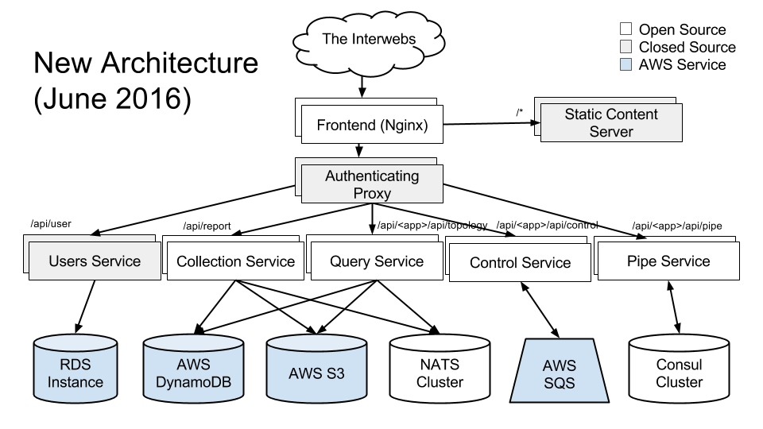

# Playbook

## General Advice

- If experiencing high latency, general advice is to look at latency of dependent services (recursively) until you find the culprit.  Scale the culprit up.
- If experiencing high error rates, general advice is to look at error rates of dependent services (recursively) until you find the culprit.
- Use [grafana](https://cloud.weave.works/admin/grafana/dashboard/file/services.json) for this.
- Check the logs!  We currently don't have any way to aggregate logs, so check logs for each replica with `kubectl logs <pod name>`.
- Check [kubediff](https://cloud.weave.works/admin/kubediff) to see if something has changed.

Links:
- http://status.aws.amazon.com
- http://status.quay.io/
- https://status.github.com/

## Kubernetes Infrastructue

- If you suspect host-level problems, you can ssh into a host by using the `./infra/get-node-ips` script (to get the ip address).
- Kubelet logs can be obtained with `sudo journalctl -r -u kubelet`
- This page is helpful: https://github.com/kubernetes/kubernetes/wiki/Debugging-FAQ

## Per service notes

### Frontend

**What**:
- A pretty standard Nginx
- Proxies requests to the AuthFE and Users service.
- Terminates SSL.

**Code**: [service/frontend-mt](https://github.com/weaveworks/service/tree/master/frontend-mt)

**If showing errors or high latency**:
- Look at downstream services for high error rates or latencies.
- Otherwise could be bad configuration, which is compiled into the container.  Check the logs.
- NB Nginx is setup to resolve hostnames on every request, so a failure in KubeDNS or misconfiguration or resolver could cause a complete outage.  We inject the IP address of KubeDNS from the the yaml.

### Authfe

**What**:
- Checks authentication on every request,
- Proxies through to the relevant component.
- Logs events to a sidecar, which then sends to bigquery.
- Adds header to downstream requests to identify organisation.

**Code**: [service/authfe](https://github.com/weaveworks/service/tree/master/authfe)

**If showing errors or high latency**:
- Look at downstream services for high error rates or latencies.
- Very little configuration; it's all in the code.

### Users

**What**:
- Manages signup and login work flow.
- Accepts requests directly from frontend, and from authfe.
- Talks to Users DB for storage.

**Code**: [service/users](https://github.com/weaveworks/service/tree/master/users)

### Collection

**What**:
- Takes reports and writes them to S3
- Write time-based index of reports to DynamoDB
- Also pushes report key to NATS for shortcut reports

**Code**: [scope](https://github.com/weaveworks/scope)

**If showing errors or high latency**:
- Look at Dynamodb / S3 / NATS.
- NB service won't start if it can't contact NATS.  Check the logs.

### Query

**What**:
- Reads report keys from DynamoDB
- Then reads reports from S3
- Has in process cache of decoded, decompressed reports
- Listens on NATS for shortcut reports

**Code**: [scope](https://github.com/weaveworks/scope)

**If showing errors or high latency**:
- Look at Dynamodb / S3 / NATS.
- NB service won't start if it can't contact NATS.  Check the logs.

### Controls

**What**:
- Accepts control requests (HTTP POSTs) from the UI, writes control requests to SQS, waits for responses
- Accepts WS connections from probes, listens for control requests on SQS, forwards  responses back to SQS

**Code**: [scope](https://github.com/weaveworks/scope)

### Pipes

**What**:
- Accepts pipe websockets from the UI & probe
- Maintains state of WS termination in Consul
- Uses consul to coordinate bridging WS connections
- Blindly copies everything from UI<->bridge connection<->probe

**Code**: [scope](https://github.com/weaveworks/scope)

### Users DB

**What**:
- Stores user details, credentials, org mappings
- Is an AWS RDS instance

**Useful info**:
- Can get a DB shell using `./infra/database`
- Can see stats, management operations in AWS console

### DynamoDB

**What**:
- Stores time-based index of reports

**Useful info**:
- QPS is statically provisioned by terraform.
- Will throttle (appearing as high latency) if you exceed this.

**If showing errors or high latency**:
- Increase Read/Write QPS in AWS console

### S3

**What**:
- Stores reports

### NATS

**What**:
- Stateless, ephemeral pub-sub message bus
- Used to publishing shortcut report ids from collection service to query service.

### Consul

**What**:
- Stores pipe state
