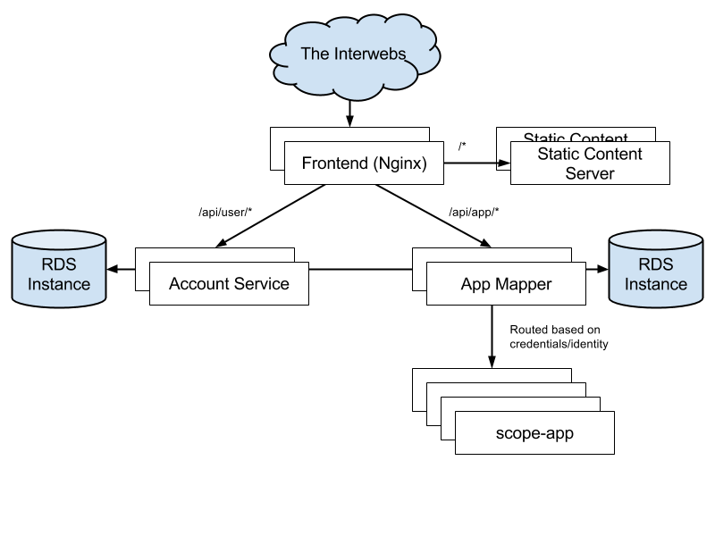

# Scope As A Service

[](https://circleci.com/gh/weaveworks/service/tree/master) [](https://coveralls.io/github/weaveworks/service?branch=coverage)



## Run the infrastructure

On your Linux host or VM, start Weave. You must build Weave yourself from
current master, using Weave 1.0.1 or latest on Docker Hub is not recent enough!
Also, you must make sure running weave globally will invoke the weave script
from current master.

```
cd $GOPATH/src/github.com/weaveworks
git clone https://github.com/weaveworks/weave
cd weave
make
sudo rm -f /usr/local/bin/weave
sudo ln -s $GOPATH/src/github.com/weaveworks/weave/weave /usr/local/bin/weave
weave launch
eval $(weave env)
```

You must also have Terraform installed on your VM.  We use a custom built version of terrafrom, from
https://github.com/tomwilkie/terraform/tree/dev (includes terraform/3364 and terraform/3509).

```
wget https://storage.googleapis.com/service-tools/terraform_darwin_amd64.zip -O /tmp/terraform.zip
wget https://storage.googleapis.com/service-tools/terraform_linux_amd64.zip -O /tmp/terraform.zip
sudo unzip /tmp/terraform.zip -d /usr/local/bin
```

Now, still on your Linux host or VM, build the service and deploy it locally.

```
cd $GOPATH/src/github.com/weaveworks/service
make
./deploy.sh -local
```

Now, we need to get your laptop onto the Weave network with the other components.
We have a handy connect.sh script for that.

```
vagrant ssh-config >> ~/.ssh/config  # maybe necessary if you're using Vagrant
./connect.sh <hostname>
```

It will tell you how to configure your host/browser to talk over the Weave network to the remote components.
When configuring your system proxies, ensure that proxies are *not* bypassed for `*.local`.

## Test the workflow

From your Mac,

1. http://scope.weave.works — sign up
1. http://smtp.weave.local — you should see a welcome email
1. http://users.weave.local/private/api/users — approve yourself
1. http://smtp.weave.local — click on the link in the approval email
1. Use the token in the approval email to start a probe:

  ./scope launch --service-token=lhFr_M4SwtOmjLrrxHc2 frontend.weave.local:80

1. Navigate to http://scope.weave.works and behold the beauty

Note that you'll need to preload a recent build of the Scope image.

## Deploy a new version of a service

```
┌ Local VM or VPS ─ ─ ─ ─ ─ ─ ┐     ┌ Remote (local, dev, prod) ─ ┐

│                ┌──────────┐ │     │ ┌─────────────────────────┐ │
                 │  Docker  │         │         Docker          │
│ ┌──────┐       │  ┌─────┐ │ │     │ │ ┌─────┐     ┌─────────┐ │ │
  │source│───────┼─▶│Image│─┼─────────┼▶│Image│────▶│Container│ │
│ └──────┘   ▲   │  └─────┘ │ │  ▲  │ │ └─────┘  ▲  └─────────┘ │ │
             │   └──────────┘    │    └──────────┼──────────────┘
│            │                │  │  │            │                │
             │                   │               │
│            │                │  │  │            │                │
             │                   │               │
└ ─ ─ ─ ─ ─ ─│─ ─ ─ ─ ─ ─ ─ ─ ┘  │  └ ─ ─ ─ ─ ─ ─│─ ─ ─ ─ ─ ─ ─ ─ ┘
             │                   │               │
             │                   │               │
             │                   │               │
           make               push.sh        deploy.sh
```

1. Make and merge changes following a normal PR workflow.
1. Produce up-to-date Docker image(s) on your local VM: `make`
1. Login to Quay with `docker login quay.io`. This only needs to be done once.
   If you don't have access to Quay ask a fellow scopet to grant it. If you
   already have access to Quay and are unsure about what credentials to type,
   go to https://quay.io/tutorial/. (You will need to set up a Quay password.)
1. Push the image(s) to the relevant hosts: `./push.sh -dev servicename`
1. Connect to the environment: `./connect.sh -dev`. You don't need to export
   anything; the deploy script takes care of that.
1. Deploy to the environment: `./deploy.sh -dev`
1. Commit and push the new .tfstate to master!

Replace `-dev` with `-local` or `-prod` as appropriate.

## Destroying/recreating all the containers

Sometimes it may be nessecary to destroy & recreate all the containers.
To do this, run:

```
terraform show dev.tfstate | grep docker_container | grep -v taint | sed  's/\://' | xargs -n1 terraform taint --state=dev.tfstate
```

Which will 'taint' all the containers, causing Terraform to destroy and
recreate them the next time you run ./deploy.sh.
