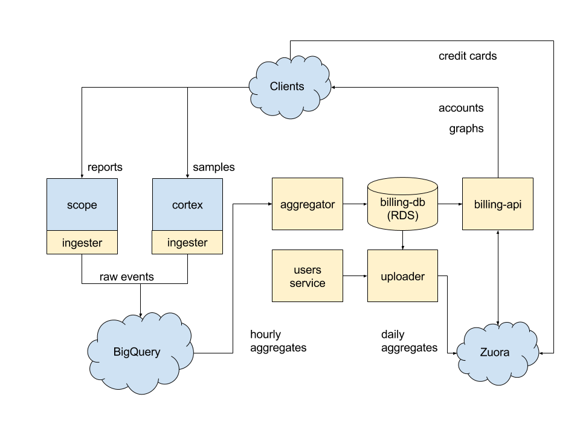

# Weave Cloud Billing Services

 

Billing in Weave Cloud consists of the following components:

- `ingester` - a sidecar container that captures events from scope (or others) and writes billing events to BigQuery
- `aggregator` - a job which periodically queries BigQuery and writes aggregated summaries to the billing DB
- `uploader` - a job which once/day queries the users service and billing DB, then uploads daily summaries to zuora
- `enforcer` - a job which periodically queries trial expiration and triggers notifications
- `billing-db` - a Postgres RDS instance container summaries billing info
- `billing-api` - a job which serves the billing API to users, for them to add credit card details, see usages etc
- `zuora` - an external service which actually does the billing

## Architecture

([Source](https://docs.google.com/drawings/d/1VH9RBIwaFXqAMOtevYeiQ_A8CNTbctrhwhLE6GK_w9c))

## Services

### Ingester

The ingesters job is to collect billing events with and send them to BigQuery.  It is a Fluentd instance with a custom plugin.

`ingester/` contains the source files needed to make a Docker sidecar image that collects Billing events using [Fluentd](http://www.fluentd.org/) and sends them to a bigquery table for querying. This image is designed to be used in conjunction with the [service-billing-client library](https://github.com/weaveworks/billing-client).

### Billing API

### Billing Admin

Internal service and UI for billing admin

## Developing

### Building, testing and running

See the makefile for all instructions.

### Documentation

Most of the documentation is within the code.
